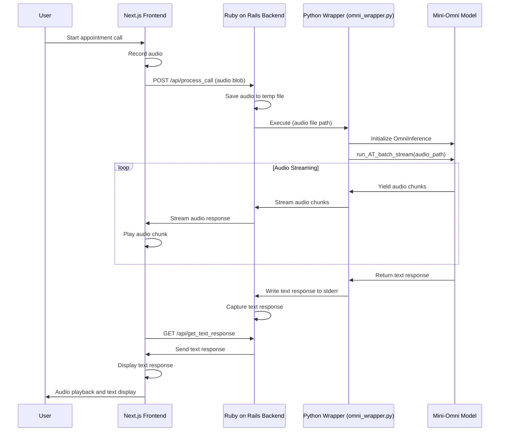

```mermaid
sequenceDiagram
    participant User
    participant NextJS as Next.js Frontend
    participant Rails as Ruby on Rails Backend
    participant Python as Python Wrapper (omni_wrapper.py)
    participant MiniOmni as Mini-Omni Model

    User->>NextJS: Start appointment call
    NextJS->>NextJS: Record audio
    NextJS->>Rails: POST /api/process_call (audio blob)
    Rails->>Rails: Save audio to temp file
    Rails->>Python: Execute (audio file path)
    Python->>MiniOmni: Initialize OmniInference
    Python->>MiniOmni: run_AT_batch_stream(audio_path)
    loop Audio Streaming
        MiniOmni->>Python: Yield audio chunks
        Python->>Rails: Stream audio chunks
        Rails->>NextJS: Stream audio response
        NextJS->>NextJS: Play audio chunk
    end
    MiniOmni->>Python: Return text response
    Python->>Rails: Write text response to stderr
    Rails->>Rails: Capture text response
    NextJS->>Rails: GET /api/get_text_response
    Rails->>NextJS: Send text response
    NextJS->>NextJS: Display text response
    NextJS->>User: Audio playback and text display
```

