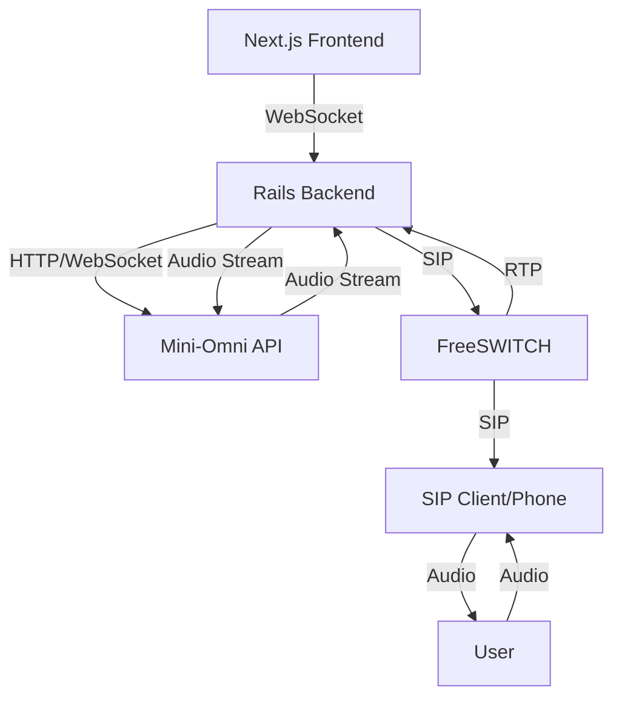
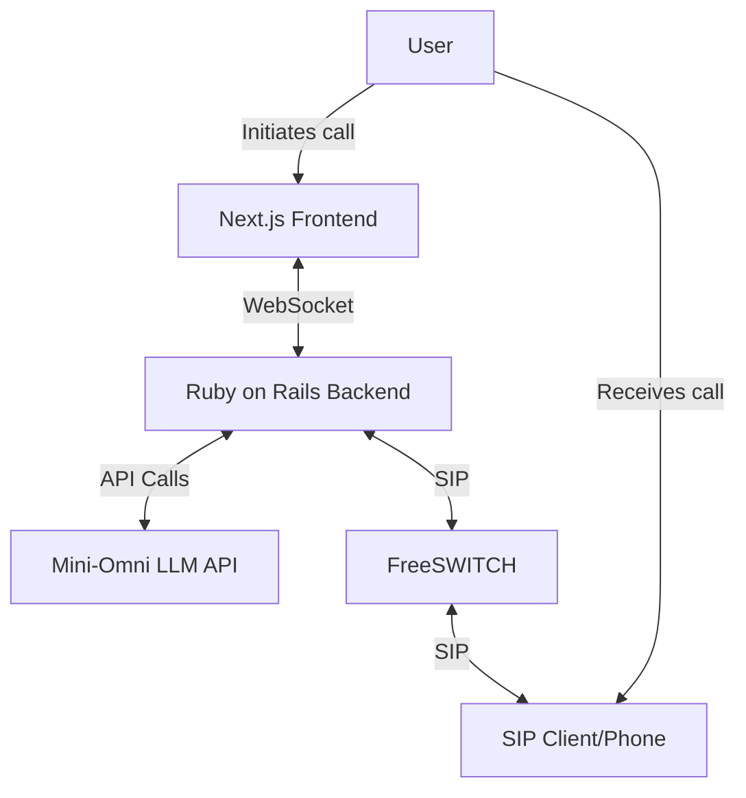

---

# Phonify - Simulated Telephony Environment

## Overview
Phonify is a simulated telephony environment designed to facilitate the development and testing of the ISS Appointment Setter. It leverages FreeSWITCH to create a mock phone system, allowing for realistic testing of AI-driven conversations without incurring real-world telephony costs. This system integrates with our existing Next.js frontend, Ruby on Rails backend, and the Mini-Omni LLM API to provide a complete end-to-end testing environment for our AI appointment setting service.

## User Story
AS A developer working on the ISS Appointment Setter
I WANT a simulated phone system that integrates with our AI backend
SO THAT I can test and refine our AI-driven appointment setting conversations without incurring real-world call costs

## Acceptance Criteria
- [ ] [[Set up FreeSWITCH in Docker]]
- [ ] [[Integrate FreeSWITCH with Rails backend]]
- [ ] [[Implement SIP client in Next.js frontend]]
- [ ] [[Create mock call initiation and receiving interface]]
- [ ] [[Integrate Mini-Omni processing into mock call flow]]
- [ ] [[Implement audio streaming between components]]
- [ ] [[Set up logging and monitoring for mock calls]]
- [ ] [[Create automated test suite for common conversation scenarios]]
- [ ] [[Document usage and testing procedures for the team]]

---
