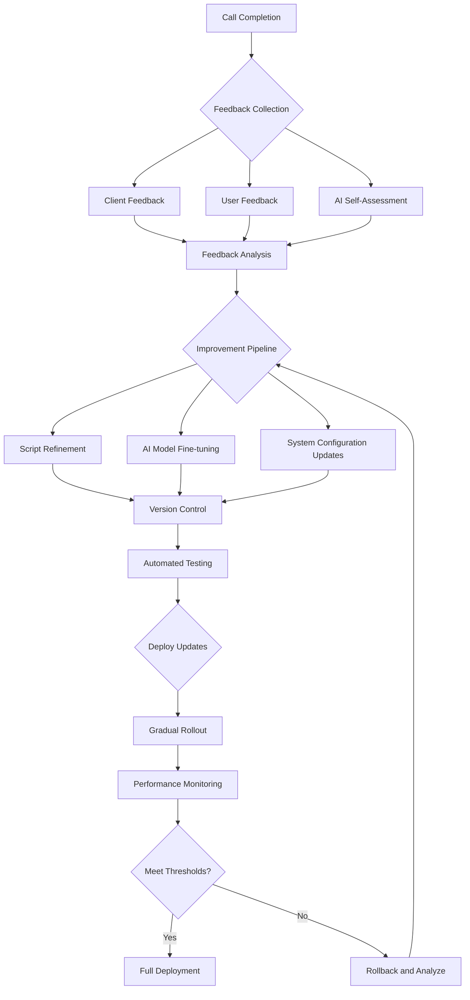

```mermaid
graph TD
    A[Call Completion] --> B{Feedback Collection}
    B --> C[Client Feedback]
    B --> D[User Feedback]
    B --> E[AI Self-Assessment]
    C --> F[Feedback Analysis]
    D --> F
    E --> F
    F --> G{Improvement Pipeline}
    G --> H[Script Refinement]
    G --> I[AI Model Fine-tuning]
    G --> J[System Configuration Updates]
    H --> K[Version Control]
    I --> K
    J --> K
    K --> L[Automated Testing]
    L --> M{Deploy Updates}
    M --> N[Gradual Rollout]
    N --> O[Performance Monitoring]
    O --> P{Meet Thresholds?}
    P -->|Yes| Q[Full Deployment]
    P -->|No| R[Rollback and Analyze]
    R --> G
```
