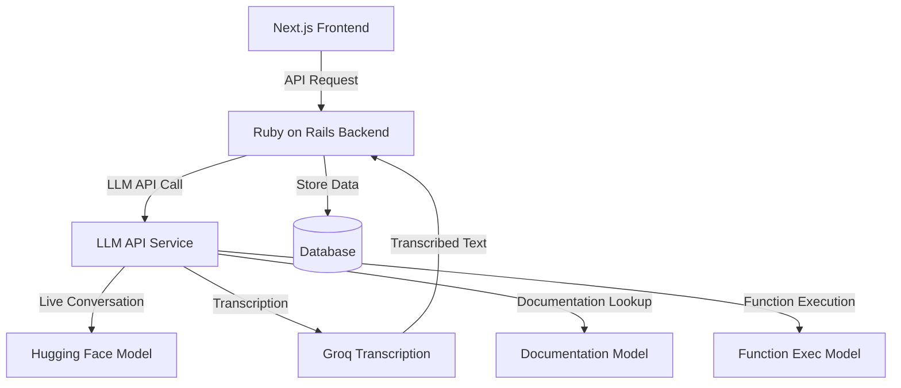

```mermaid
graph TD
    A[Next.js Frontend] -->|API Request| B[Ruby on Rails Backend]
    B -->|LLM API Call| C[LLM API Service]
    C -->|Live Conversation| D[Hugging Face Model]
    C -->|Transcription| E[Groq Transcription]
    C -->|Documentation Lookup| F[Documentation Model]
    C -->|Function Execution| G[Function Exec Model]
    B -->|Store Data| H[(Database)]
    E -->|Transcribed Text| B
```