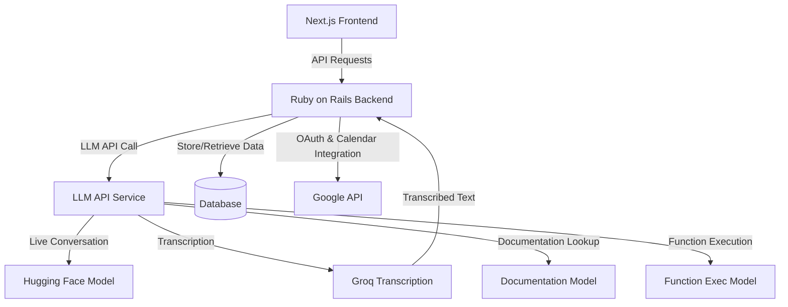

## Considerations
1. Security and Data Management:
   - It's generally more secure to handle sensitive data and API interactions on the server-side (Ruby on Rails in this case).
   - OAuth tokens and user data should be stored securely on the backend.

2. LLM API Interaction:
   - While it's possible for Next.js to directly call the LLM API, having Ruby on Rails handle this maintains a single point of control for all external API interactions.
   - This approach also allows for easier implementation of rate limiting, logging, and error handling.

3. Database Models:
   - Ruby on Rails should handle all database interactions for consistency and to leverage its robust ORM (Active Record).

4. Next.js Role:
   - Next.js should focus on rendering the UI and handling client-side state.
   - It can make API calls to Ruby on Rails, which then orchestrates further actions (database queries, LLM API calls, etc.).

## Components and responsibilities

1. Next.js Frontend:
   - Handles UI rendering and client-side state management
   - Makes API calls to Ruby on Rails for all data and action requests
   - Manages user interactions and displays results

2. Ruby on Rails Backend:
   - Serves as the central API for the frontend
   - Handles authentication (OAuth with Google)
   - Manages database interactions (storing user data, client lists, call logs)
   - Orchestrates LLM API calls and processes results
   - Integrates with Google Calendar API
   - Implements business logic (filtering clients, scheduling calls)

3. Database (managed by Ruby on Rails):
   - Users table (including OAuth tokens)
   - Clients table (with insurance policy information)
   - Call logs table
   - Cached calendar events table

4. LLM API Service:
   - Handles conversation flow
   - Performs transcription
   - Manages documentation lookup and function execution

This architecture allows you to:
1. Keep sensitive data and operations server-side
2. Centralize API interactions through Ruby on Rails
3. Leverage Next.js for a responsive and interactive frontend
4. Maintain clear separation of concerns

To implement this:

1. Start with setting up the Ruby on Rails backend:
   - Implement user authentication with Google OAuth
   - Create database models for users, clients, and call logs
   - Set up API endpoints for frontend interactions
   - Implement Calendar API integration

2. Develop the Next.js frontend:
   - Create UI components for user interactions
   - Implement API calls to Ruby on Rails backend
   - Handle state management (e.g., with React hooks or a state management library)

3. Integrate LLM API:
   - Implement API calls from Ruby on Rails to the LLM service
   - Set up conversation handling and transcription processing

4. Implement call scheduling and management logic in Ruby on Rails

5. Develop caching mechanism for calendar events in Ruby on Rails

This approach allows you to focus on building a secure, scalable application while keeping the architecture clean and maintainable. You can start by implementing core features in the Next.js frontend and Ruby on Rails backend, then gradually integrate the LLM capabilities as you progress.